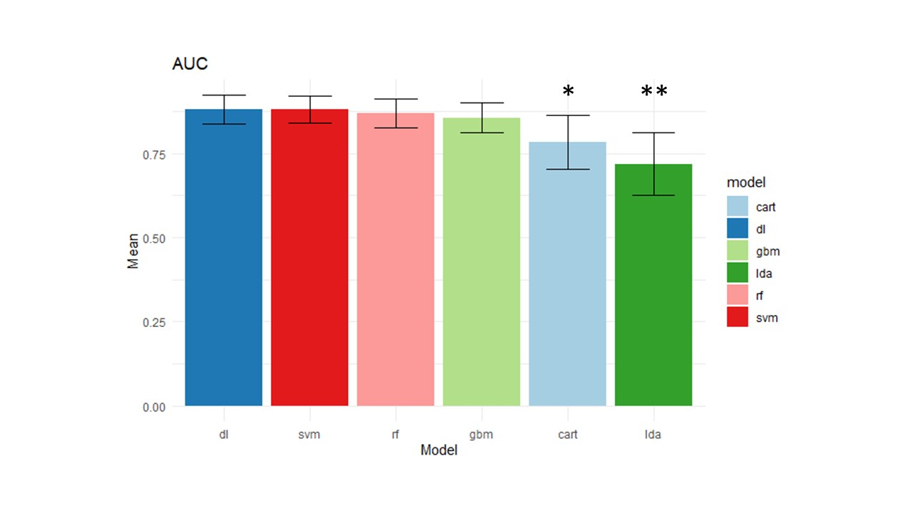
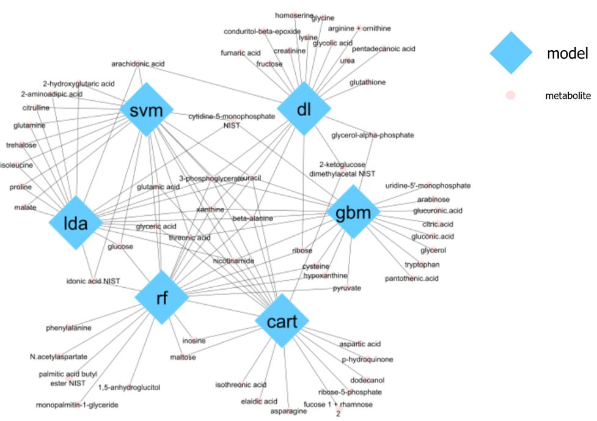

# Comparative Study of Machine Learning Algorithms for Estrogen Receptor Status Prediction Using Breast Cancer Metabolomics Data
Full study available [here](breast_cancer_metabolomics_paper.pdf)

## Abstract
Metabolomics, the comprehensive analysis of metabolites in a biological sample, is emerging as an important tool for detecting altered cellular processes in diseased individuals. In this study, metabolomics data (n=271) are used to test the accuracy of various machine and deep learning models on an estrogen receptor status classification task. The Deep Learning framework was the optimal model in terms of area under the receiver-operating characteristic (AUC), with support vector machines and random forests performing as a close second and third, respectively. Further analysis of predictor importance reveals the biological significance of these approaches and areas for future investigation.

## Results

  
   

<b>(Left)</b> Predictive Accuracy Measured by Average AUC  &nbsp; &nbsp;  <b>(Right)</b> Biaprtite Network for Predictor Importance
